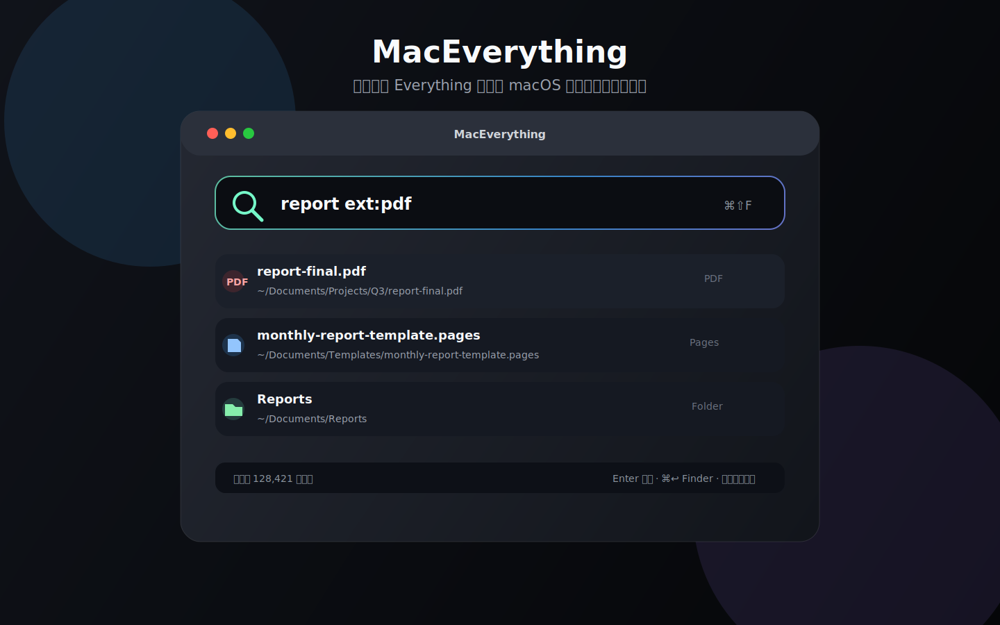

# MacEverything

<p align="center">
  <strong>Everything-style instant file search for macOS.</strong>
</p>

<p align="center">
  <a href="https://github.com/crimson-gzx/mac-everything/releases"></a>
  <a href="LICENSE"></a>
  
  
</p>

[中文说明](README.zh-CN.md) · [中文安装说明](INSTALL.zh-CN.md) · [Installation](INSTALL.md) · English

<p align="center">
  
</p>

MacEverything is a native macOS file search app inspired by Windows Everything. It builds a local SQLite/FTS-backed index, gives you near-instant filename search, and keeps results fresh with macOS FSEvents.

Highlights: global hotkey, Everything-like query syntax, index/exclusion folders, saved filters, search history, Quick Look preview, live updates, and visible performance metrics.

> If this project is useful, please consider giving it a star. It helps more Mac users find a fast Everything-like search tool.

## Download

Download the latest build from GitHub Releases:

```text
https://github.com/crimson-gzx/mac-everything/releases
```

Recommended: download `MacEverything-v0.10.0.dmg`, open it, then drag `MacEverything.app` to `Applications`.

If macOS blocks the app because it was downloaded from the internet, right-click the app and choose **Open**.

The first launch can feel slower than later launches because macOS verifies downloaded apps and MacEverything initializes its local SQLite/FTS index. If you rebuild the index, it also needs to scan your selected folders. After indexing finishes, normal searches should be much faster.

The current GitHub Release build is not yet Developer ID signed or Apple-notarized, so macOS may show an “unverified developer” or “unsafe” warning. The temporary workaround is right-click → **Open**. The proper public-distribution fix is a Developer ID signed and notarized DMG.

Privacy note: MacEverything is fully open source. Its current core feature set is local filename indexing and search. It does not require login, does not require network access for core features, and does not upload your file list, file contents, or search history. Indexes and settings are stored locally on your Mac by default.

## Features

- Fast file and folder search from an in-memory index
- Visual index root management: add, remove, reset to the default Home folder
- Visual excluded-folder management: add, remove, clear exclusions
- Settings are saved at `~/Library/Application Support/MacEverything/settings.plist`
- Search history: record executed searches, reapply them, or clear them
- Saved filters/bookmarks: built-in PDF, images, videos, modified today, large files; custom filters can be saved from the current query
- Quick Look preview from the menu, context menu, `⌘Y`, or Space when the result list is focused
- Result display options: show/hide path, modified date, size, and kind
- Performance: precomputed search records avoid repeatedly lowercasing every file name/path while typing
- Performance: file icon cache reduces repeated system icon lookups during scrolling
- SQLite index backend: prefer `file-index.sqlite`, with automatic migration from the legacy `file-index.plist`
- SQLite FTS5 candidate search: plain keyword queries first ask SQLite for candidate paths, then use in-memory ranking
- Native SwiftUI macOS interface
- Menu bar app
- Global shortcut with fallback registration, preferring `⌘⇧F`
- Double-click or Enter to open
- Command + Enter to reveal in Finder
- Context menu actions: open, reveal, open parent folder, copy path
- Incremental file-system updates via FSEvents
- More Everything-like search syntax:
  - `report final` — match multiple keywords
  - `"final report"` — phrase matching
  - `*.pdf`, `report*` — wildcard matching
  - `!temp` or `-temp` — exclude keywords
  - `report|invoice` — OR matching
  - `name:photo` — match file name only
  - `path:Desktop` — match path only
  - `ext:pdf`, `ext:jpg,png` — extension filters
  - `!ext:tmp` — exclude extensions
  - `type:file`, `type:folder` — file/folder filters
  - `size:>10mb`, `size:<1gb` — size filters
  - `date:today`, `date:last7d`, `date:2026-07-04` — modified date filters
  - `sort:name`, `sort:size`, `sort:date` — sort from the search box
- Sort menu: relevance, name, path, modified date, file size

## Requirements

- macOS 14 or later
- Apple Silicon Mac for the included local build script output
- Swift toolchain / Xcode command line tools

## Build and run

```bash
swift run
```

Build a release binary:

```bash
swift build -c release
```

Build a local `.app` bundle:

```bash
zsh build-app.sh
```

Build ZIP and DMG release artifacts:

```bash
zsh scripts/package-release.sh 0.10.0
```

## Notarization

See [NOTARIZATION.md](NOTARIZATION.md).

## Permissions

For best results, grant Full Disk Access:

```text
System Settings → Privacy & Security → Full Disk Access → MacEverything
```

Then reopen the app and rebuild the index from the menu.

Without Full Disk Access, macOS may block some protected locations such as Desktop, Documents, Downloads, or application data folders.

## Index storage

The local index is saved at:

```text
~/Library/Application Support/MacEverything/file-index.sqlite
```

## Mac App Store note

The current prototype scans the user's home directory and recommends Full Disk Access. That is useful for direct distribution, but not ideal for Mac App Store review.

A future App Store-friendly version should use explicit folder selection and security-scoped bookmarks instead of default home-folder scanning.

## How it differs from Windows Everything

Windows Everything can read NTFS metadata such as the MFT/USN journal. macOS/APFS does not expose an identical public interface for third-party apps.

MacEverything therefore uses a practical native approach:

1. Initial directory scan
2. Binary plist cache
3. In-memory ranked search
4. FSEvents incremental updates

Daily search should feel instant after the first index build, but the initial scan still needs to walk directories.

## Roadmap

- Folder selection UI
- Better keyboard shortcut preferences
- Search result preview
- DMG notarization
- Real `.icns` app icon
- App Store-friendly sandbox mode
- Better ranking and fuzzy matching

## License

MIT
